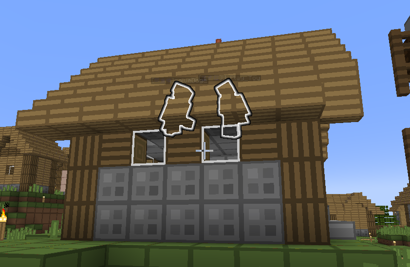
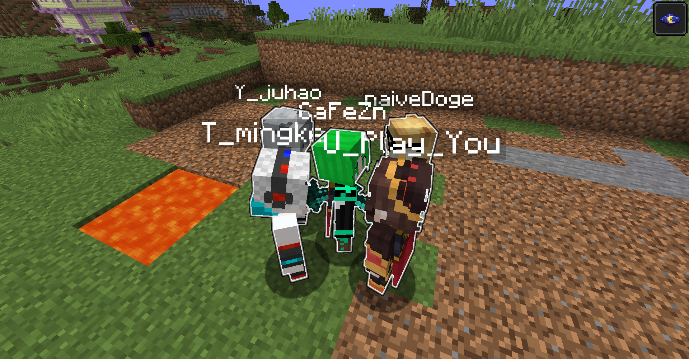

# PlayerHighLighter

## what is / 简介

Sometimes it is difficult to see the player when playing on the server, it is more convenient to find the player after adding this mod.

这个mod方便在服务器中发现其他玩家
## how to use / 用法

using key "comma" to control ON/OFF (able to change in key binding)

使用 “逗号” 控制开关 (可在按键设置中修改)
## dependence / 依赖

[Fabric API](https://github.com/FabricMC/fabric)

## picture / 效果图

## License / 许可证

[GNU General Public License v3.0 / GPL3.0](LICENSE)

