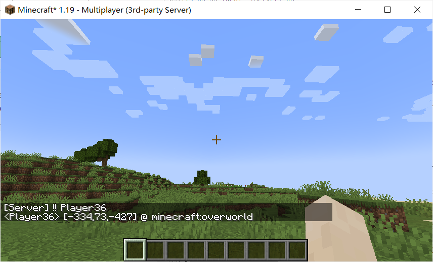
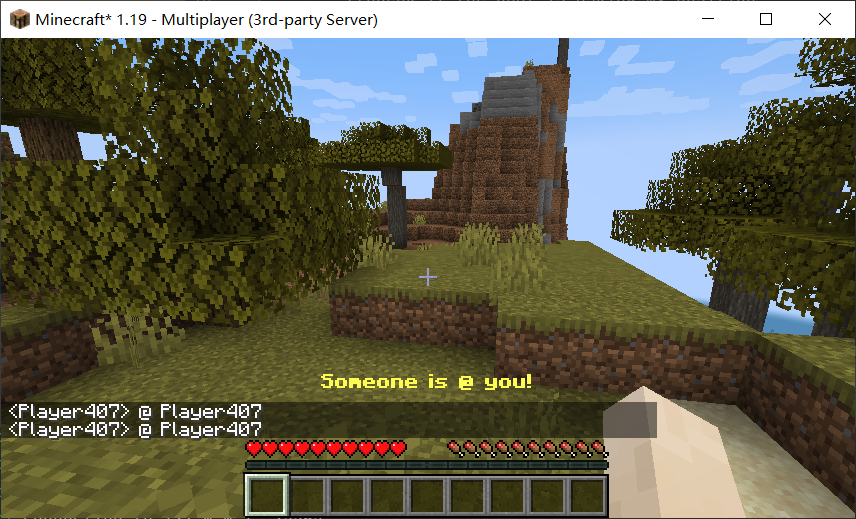

# PlayerHighLighter

## what is / 简介

Sometimes it is difficult to see the player when playing on the server, it is more convenient to find the player after adding this mod.

it support get someone's position and @ someone

这个mod方便在服务器中发现其他玩家

它支持获取某人的位置和 @ 某人
## how to use / 用法

if you want to get someone's position, just chat "!! PlayerName"

if you want to @ someone, just chat "@ PlayerName"
also, it support "!! all" and "@ PlayerName"

using key "comma" to control ON/OFF (able to change in key binding)

使用 “逗号” 控制开关 (可在按键设置中修改)

如果你想知道某人的位置，只要输入 “!! 玩家名”

如果你想 @ 某人，只要输入 “@ 玩家名”

同时，它支持 “!! all” 和 “@ 玩家名”

## dependence / 依赖

[Fabric API](https://github.com/FabricMC/fabric)

## picture / 效果图

## License / 许可证

[GNU General Public License v3.0 / GPL3.0](LICENSE)

